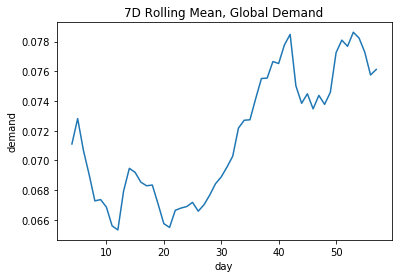

This is a compiled version for my analysis in traffic management airforsea challenge

# EDA
Overviewing the demand distribution of all dataset

## Exploring demand per hours
Quickly looking at the given data for each hours

Here we could find that lowest hour is 19 and from my working experience lowest internet traffic should be found at about 3 a.m, I assume this time is in GMT +0, and will continue to assume that these region should be at GMT +8 timezone.

## Deriving Day of Week
Plotting the demand on each day and for each hour (+8 h)

we can see that day 5,6; 12,13; 19,20; and so on has different pick up rate, that is dark area tends to rise at > 10:00. Therefore I could guess that this is the weekend effect.

## Peeking Cities Median Demand

There are some cities that produces more demands than others

## Looking for Geo Attributes

Plotting kdeplot with only `lat` and `long` gave me an idea to generate center of city attributes, like where is the nearest center of city and how far a region is from the center of city.

We can do this easily using KMeans with `n_cluster` = 2. `n_cluster` is 2 because kde has estimate the density peaked on 2 place making 2 ponds at the graph.

Where red `x` is the center point of a city.

Calculating distance to each center point resulting in this distributions

This arguments has been strengthen by this trisurface graph, between:
`lat`, `long`, and `median_demand` (per each geo region)

## More Geo vs Demand Attributes
Because I have seen that the evidence of geo and hour could be determining demand, I tried to create a feature from clustering these attributes: 'geo', 'dow', 'hour', 'median_demand_per_gdowh', 'mean_demand_per_gdowh'.

Using `GaussianMixtureModel` then AIC and BIC plot

where:

 x = number of cluster

 y = AIC and BIC value

I could determine the local optimum cluster number to be **8**. This clustering feature will fill in `cluster_gdowh` attribute

## Exploring Global Trends
I was looking to see if there is any global trend happening, that potentially could be use to de-trend our timeseries data.

however the trend could only be smoothly observed per month as shown at graph.

# Feature Generation & Preprocessing 

## Categorical Features
|Feature Name|Description|
|---|---|
|`is_weekend`|if the day is weekend|
|`dow`|day of week|
|`hour`||
|`cluster_gdowh`|clustering feature for geo and median demand per hour|
|`is_working_hour`|working hour classification 9-17 by GMT+8|
|`cluster_geo`|0 or 1, whether the region near "center of city" 0 or the other|

## Numerical Features
|Feature Name|Description|
|---|---|
|`lat`| latitude extracted from geohash|
|`long`| longitude extracted from geohash|
|`minute`||
|`mean_demand_per_geo`| mean demand per place|
|`median_demand_per_geo`|median demand per place|
|`mean_demand_per_gdow`|mean demand per place per day of week|
|`median_demand_per_gdow`|median demand per place per day of week|
|`mean_enc_demand_tmin1`|mean encoding of lag t-1 demand per geo, dow, hour|
|`mean_enc_demand_tmin4`|mean encoding of lag t-4 (1 hour) demand per geo, dow, hour|
|`mean_enc_demand_tmin672`|mean encoding of lag t-672 (1 week) demand per geo, dow, hour|
|`demand_gdow_q95`|quantile .95 of demand group by geo and dow|
|`demand_gdow_q10`|quantile .10 of demand group by geo and dow|
|`mean_demand_diff_wt_gdow_q95`|current demand - `demand_gdow_q95`|
|`mean_demand_diff_wt_gdow_q10`|current demand - `demand_gdow_q10`|
|`cluster_prob_gdowh`|probability of cluster feature for geo and median demand per hour (from `cluster_gdowh`)|
|`demand_rolling_4`|rolling `demand` mean with window 4|
|`dist_to_center_km`|distance to the nearest "center of city" in KM|

## Additional Notes for Features
`demand_gdow_q95`, `demand_gdow_q10`, `mean_demand_diff_wt_gdow_q95`, `mean_demand_diff_wt_gdow_q10` were formed because the first `CatBoost` model does not detect extreme values in train data. Since I applied these guidance feature, it could more tolerant to predict extreme values:
 

# Modeling

## Preprocessing For TreeBasedModel
1. For categorical features, I did not do anything specific
2. For numerical features, Use `SimpleImputer`, impute missing values with constant = 0

## Preprocessing For Linear Based Model
1. For categorical features, I did `OneHotEncoding`
2. For numerical features, Use `SimpleImputer`, impute missing values with constant = 0

## Experiment Setup
First split the dataset, take 30% of dataset (because the data is large enough) for our experiment using `util.get_train_data`, so it does not shuffle and take the data sequentially.

Then from this 30% dataset (About 18-19 days), split into train and test, using 14 days as train and the other as test.

## Model Evaluation
|Model Name|RMSE Avg|Description|
|---|---|---|
|`BenchmarkModel`|0.026759431402815583|Using mean demand per geo, dow, hour, minute to predict future demands, implementation class: `BenchmarkModel1`|
|`CatBoostModel`|0.026889828538342035|CatBoost Algorithm, implementation class: `MyCatBoostModel`|
|`XGBoostModel`|**0.025588724415189883**|XGBoost Algorithm, implementation class: `MyXGBModel`|
|`DeepLearning1`|0.07302684711554523|Feed forward neural network, implementation class: `MyDL1Model`|
|`2lvXGBoostEnsemble`|0.026123143395928146|lv1 xgboost, lv2 fit residual from lv1 prediction - actual demand, implementation class: `MySimple2LvXGBoostModel`|

# Conclusion
## Current Conclusion
With this experiment I have concluded that `XGBoost` will be the final model implemented in `trainer.py` using defined feature generation and preprocessing, implemented at `MyXGBModel` class

## Further Works
Possible improvements for this works:
1. Using LSTM / GRU model for time series analysis
2. Using Encoder Decoder Architecture
3. 2 Level Ensembling: from multiple regressor to predict demand and learn weight each of meta-features to generate more accurate result